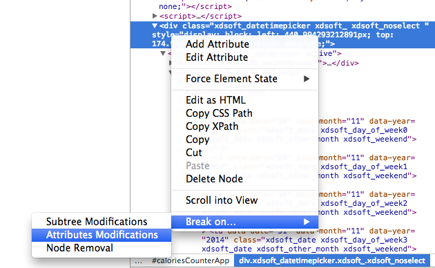
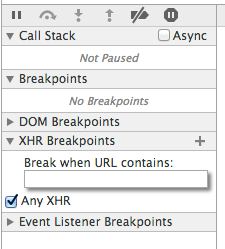
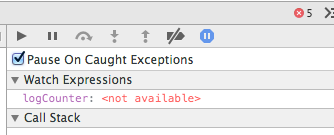
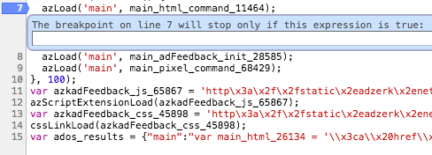
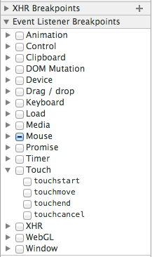

# Debugging

### Shortcut to opening the console
`Ctrl+Shift+I` or `Cmd+Option+I` (mac)

### What code is changing this section of the page?
One common scenario happens when a section of the page is modified, but it's not clear by which part of the code. By pointing and right-clicking the HTML element on the page, it's possible to setup a breakpoint that will be triggered when that page element is modified:  

### Who is doing this Ajax request?
Sometimes an ajax request is made, but it's not clear which part of the code is doing it. On the sources tab there is an XHR breakpoint section, where it's possible to add Ajax breakpoints by clicking `Any XHR`:  

### Trigger a breakpoint when an exception occurs
The Chrome Dev Tools allow having the debugger stop everytime that an exception is thrown. This can be activated using the pause button in the sources tab. The checkbox just below it allows to pause the debugger only if the exception is uncaught:  

### Conditional breakpoints
A condition can be added to the breakpoint by right-clicking on the line number and choosing `Edit breakpoint`:  

### Event breakpoints
Besides Ajax requests, all sort of events might be made to trigger a breakpoint: mouse clicks, double clicks, blur/focus events, `setTimeout`, etc. These breakpoints can be set on the sources tab, in the **Event Listener Breakpoints** section:  

### Frequently used debug snippets
The Chrome Dev Tools give the developer the possibility to save a small script for future use. This functionality is available on the sources tab, on the sub-tab `Snippets`:  
This functionality can be used for storing frequently used debugging snippets, made by you or other developers. Some of the [most useful snippets](https://github.com/paulirish/devtools-addons/wiki/Snippets) I came across are from Paul Irish (Google Dev Tools evangelist).

### Deb.js
Library for some more advanced debugging, check it out!